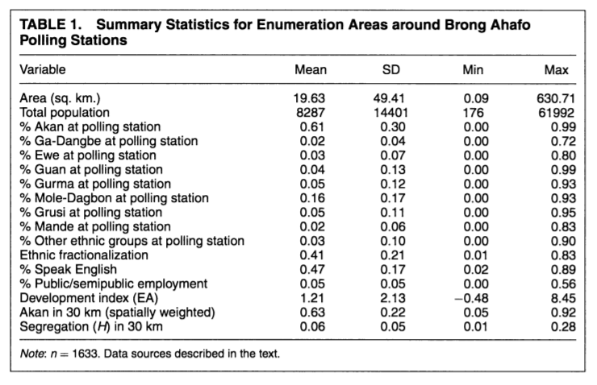

```{r setup, include=FALSE}
knitr::opts_chunk$set(echo = FALSE)
library(gt)
library(tidyverse)
```

```{r data-setup}

# read in data

data <- read.csv("IchinoNathan_APSR_pollingstation_data.csv", header=TRUE)

```

## Footnote

Analysis ^[All analysis for this paper is available [here](https://github.com/angelafu7/milestone-5).]

## Graphic

```{r graphic}

# create graphic

graphic <- data %>%
  
  # eliminate NAs
  
  na.omit() %>%
  ggplot(aes(x=akan_p_poly, y=npp2008ps_pres_p)) +
  
  # geom_point creates a scatterplot
  
  geom_point() + 
  labs(
    title = "Polling Stations by Vote and Akan Population",
    subtitle = "Comparing Akan population at polling station vs support for the NPP",
    x = "Percent Population Akan",
    y = "NPP Presidential Vote Share"
  )

# print graphic

graphic
```


## Overview

In their paper "Crossing the Line: Local Ethnic Geography and Voting in Ghana," Nahomi Ichino and Noah Nathan investigate the effects of local ethnic demographics on voters' decisions. To do this, they use data on the ethnic composition of the neighborhoods surrounding each polling station in Ghana. They then compare the demographics of that area with the vote share from the 2008 presidential election. For example, at a polling station located in an area dominated by the Akan ethnic group, they found that the vote share for the New Patriotic Party (which is associated with the Akan group) is higher than the population share of Akans. This signifies that people are more likely to vote for the party that is associated with the ethnic group living in their area. To draw this conclusion, Ichino and Nathan build several regression models in which they try to predict the NPP presidential vote share at a certain polling station. Factors included in that regression include ethnic demographics, level of developments, and proportion of the population employed in the public or semipublic sector.

## Appendix

```{r table}

# Table 1 replication

# choose pertinent data for the table

data1 <- data[,c("area_sqkm", "sex_total", "akan_p_poly", "gadangbe_p_poly", "ewe_p_poly", "guan_p_poly", "gurma_p_poly", "moledagbon_p_poly", "grusi_p_poly", "mande_p_poly", "other_eth_p_poly", "ethfrac_poly", "english_percent", "public_semipublic_p", "dev_factor2", "akan_30km_l_p", "h_30rad_e")]

# create new table

table1 <- matrix(NA, nrow=ncol(data1), ncol=4)

# this calculates summary statistics for each variable

for(i in 1:ncol(data1)){
table1[i,1] <- mean(data1[,i])
table1[i,2] <- sd(data1[,i])
table1[i,3] <-min(data1[,i])
table1[i,4] <-max(data1[,i])
}

# this labels the summary statistics

colnames(table1)<-c("Mean", "SD", "Min", "Max")

# this cuts off the numbers so there are no trailing digits

table1 <- round(table1, digits=2)

# this vector contains row lables

Variable <- c("Area (sq. km.)", "Total population", "% Akan at polling station", "% Ga-Dangbe at polling station", "% Ewe at polling station", "% Guan at polling station", "% Gurma at polling station", "% Mole-Dagbon at polling station", "% Grusi at polling station", "Mande at polling station", "% Other ethnic groups at polling station", "Ethnic fractionalization", "% Speak English", "% Public/semipublic employment", "Development index (EA)", "Akan in 30 km (spatially weighted)", "Segregation (H) in 30 km")

# add the row labels to the final table

table1 <- cbind(Variable, table1)

# use gt to make the table well-formatted and to add more details

gttable <- gt(table1) %>%
  tab_header(
    title = "Table 1",
    subtitle = "Summary Statistics for Enumeration Areas around Brong Ahafo Polling Stations" 
    ) %>%
  tab_source_note(
        source_note = md("*Note: n* = 1633. Data sources described in the text")
      )

# print table

gttable
```


## Bibliography